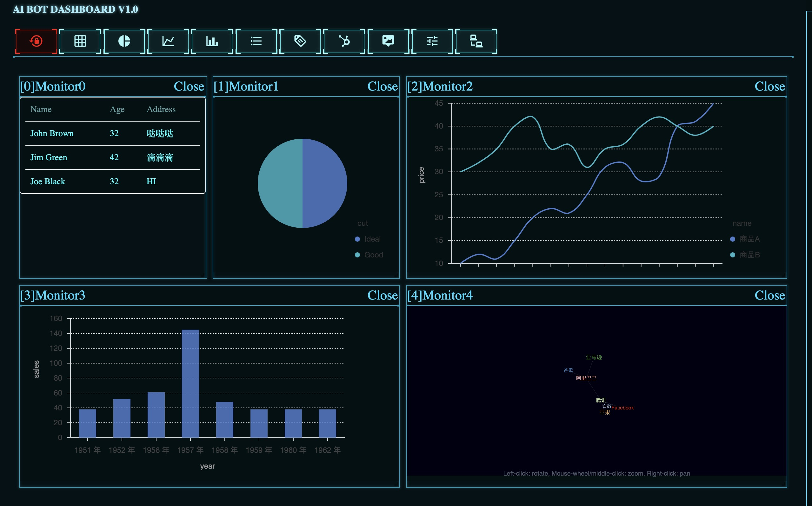

# DashIT，旨在构建一个通用的，科幻的展示平台，支持RESTFul+GraphQL等数据展示接口。

## 快速体验
* 安装依赖包： `yarn install`
* 开启调试预览：`yarn start`
* 访问：[ http://localhost:3000](http://localhost:3000/) 查看效果

# RoadMap

- [X] 拖动布局
- [X] 本地布局存储
- [ ] Redux State数据管理
- [ ] Websocket数据交互接口
- [ ] 登录/权限后台
- [ ] RESTApi/GraphQL接口
- [ ] ChatBot消息推送
